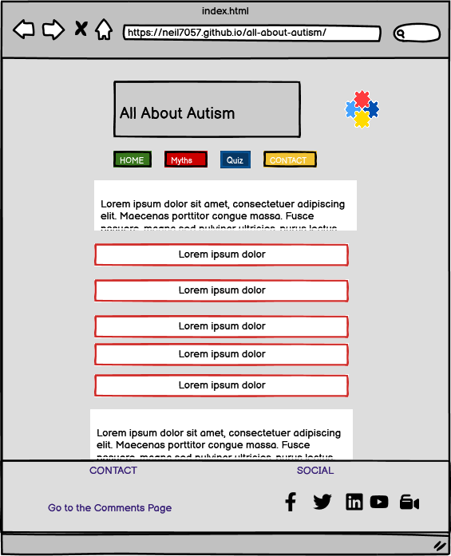
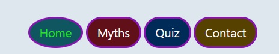
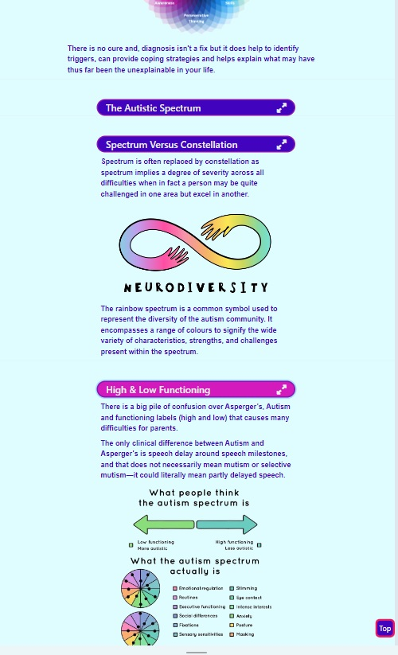
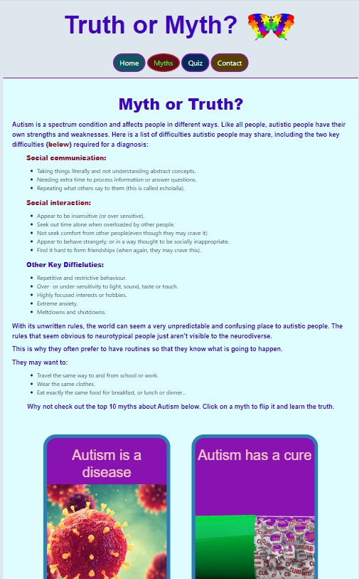
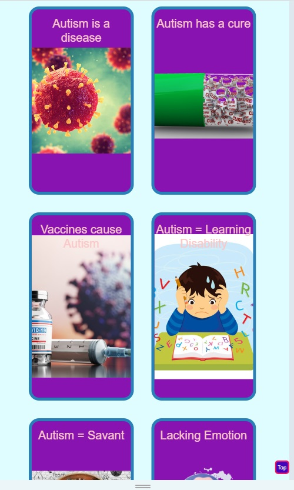
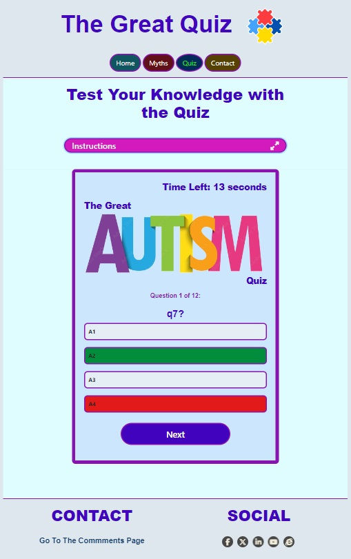
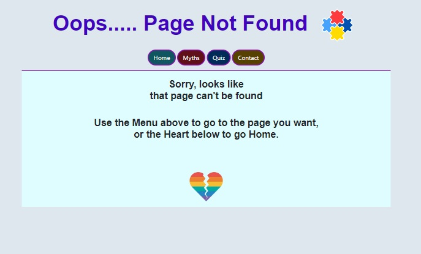
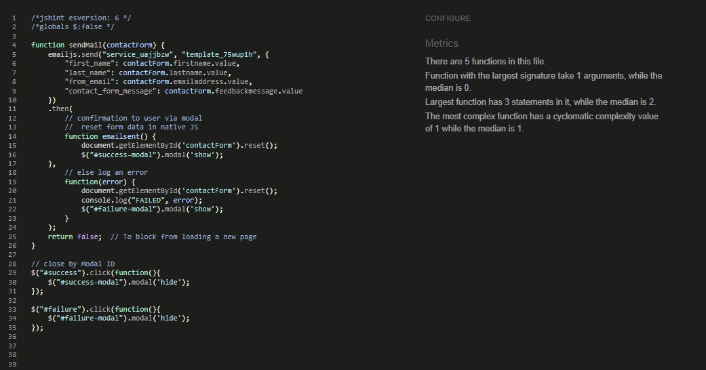
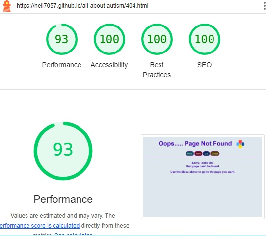

# My All About Autism Website


**Author Neil Allen**

## All About Autism

This is my website   

[View the live project here.](https://neil7057.github.io/all-about-autism/)

# Table of Contents

1. [Project Inception and Planning](#project-inception-and-planning)
2. [User Experience (UX)](#user-experience-ux)
    *   [User stories](#user-stories)
        *   [First Time Visitor Goals](#first-time-visitor-goals)
        *   [Returning Visitor Goals](#returning-visitor-goals)
        *   [Frequent User Goals](#frequent-user-goals)
    *   [Design](#design)
        *   [Colour Scheme](#colour-scheme)
        *   [Typography](#typography)
        *   [Imagery](#imagery)
        *  [Design Considerations](#design-considerations)
    *   [Wireframes](#wireframes)
        *   [Index](#home)
        *   [Myths](#myths)
        *   [Quiz](#quiz)
        *   [Contact](#contact)
        *   [Confirmation](#confirmation)
        *   [404](#404)
    *   [Structure](#structure)
3. [Features](#features)
    *   [Landing Page](#landing-page)
    *   [Myths Page](#myths-page)
    *   [Quiz Page](#quiz-page)
    *   [Contact Page](#contact-page)
    *   [Confirmation Popup](#confirmation-page)
    *   [Error 404 Page](#error-404-page)
    *   [Site Features](#site-features)
4. [Technologies Used](#technologies-used)
    *   [Development Environment](#development-environment)
    *   [Languages Used](#languages-used)
    *   [Frameworks, Libraries & Programs Used](#frameworks-libraries--programs-used)
5. [Testing](#testing)
    *   [HTML](#html)
    *   [CSS](#css)
    *   [JavaSceipt](#javascript)
    *   [Testing User Stories from User Experience (UX) Section](#testing-user-stories-from-user-experience-ux-section)
        *   [First Time Visitor Goals](#first-time-visitor-goals-1)
        *   [Returning Visitor Goals](#returning-visitor-goals-1)
        *   [Frequent User Goals](#frequent-user-goals-1)
    *   [Responsiveness](#responsiveness)
    *   [Accessibility](#accessibility)
    *   [Screen Reader](#screen-reader)
    *   [Lighthouse Testing](#lighthouse-testing)
    *   [Functional Testing](#functional-testing)
        *   [Navigation Links](#navigation-links)
        *   [Quiz Testing](#quiz-testing)
        *   [Form Testing](#form-testing)
        *   [Links Testing](#links-testing)
        *   [Footer Contact Information](#footer-contact-information)
    *   [Further Testing](#further-testing)
    *   [404 Error Testing](#404-error-testing)
    *   [Bugs and Fixes](#bugs-and-fixes)
    *   [Known Bugs](#known-bugs)
    *   [Future Releases](#future-releases)
6. [Deployment](#deployment)
    *   [Version control](#version-control)
    *   [Github Pages](#github-pages)
    *   [Deployments to Github Pages](#deployment-to-github-pages)
    *   [Clone the repository locally](#clone-the-repository-code-locally)
7. [Credits](#credits)
    *   [Code](#code)
    *   [Content](#content)
    *   [Media](#media)
    *   [Acknowledgements](#acknowledgements)

## Project Inception and Planning

## User Experience (UX)

-   ### User stories

    -   #### First Time Visitor Goals

        1. As a First Time Visitor, I want to easily understand What is Autism.
        2. As a First Time Visitor, I want to be able to easily navigate throughout the site to find content.
        3. As a First Time Visitor, I want to read about Autism and common myths and misconceptions.

    -   #### Returning Visitor Goals

        1. As a Returning Visitor, I want to find more information about Autism.
        2. As a Returning Visitor, I want to find the best way to get in contact and ask for help and advice with any questions I may have.
        3. As a Returning Visitor, I want to try the quiz and encounter different question sets.

    -   #### Frequent User Goals
        1. As a Frequent User, I want to check to see if there is any content new to me.
        2. As a Frequent User, I want to check to see if there is any new information about Myths.
        3. As a Frequent User, I want to try the quiz, encountering different questions.

-   ### Design
    -   #### Colour Scheme
        -   I've used the main colours of the various Autism icons for the menu items together with the blues and purples used by the National Autism (UK) website to create a warm feel, yet sufficiently bold and with appropriate levels of contrast. The main body background is white with a light blue for headers, footers and margins.
        -   Some colours were muted or changed to meet WAVE guidelines duirng final stage testing. 
        
    -   #### Typography
        -   The Inclusive Sans and Open Sans fonts are especially recommended for accessibility so i've chosen those as my main fonts with a default of Sans Serif.

    -   #### Imagery
        -   Each header has a different Autism icon image to celebrate the variety of the Autistic condition. 

        -   The site has additional images where it adds clarity or is the best mechanism to communicate ideas.

    -   #### Design Considerations
        -   The header of each page has a different Autism Icon and remains minimalist, clear and crisp. the Header icon links back to teh Home Page.

        -   Colours are bold and unambiguous.

        -   There are wider margins on each page in larger screen sizes as is common practice in web development. These margins reduce at smaller screen sizes. 

        -   The site is responsive with some items resized for smaller screens. Images on Myth cards are omitted at screen resolutions below 320px.

        -   Menu navigation is consistent across all pages and screen sizes and is central to each page. The menu doesn't change on screen size reduction to maintain consistency which is an important consideration for those 'on the spectrum'. The colours match the various Autism logos and options are highlighted in pink. Text font size changes when hovered over.

        -   Menu button text is white on all inactive pages and green on the active page. The menu button for the active page is changed to an oval. The logo on all pages except home, redirect to the home page.

        -   There is a customised error-404 page 'just in case'.

        -   There is a confirmation popup when a form is successfully submitted and a corresponding popup if the form submission is unsuccessful. The popup is dismissed when 'close' is slected or the user clicks outside of the form. The logo on the modal form also directs back to the Home Page.

-   ### Wireframes
-   #### Home
    <details><summary>Home - Desktop</summary>
    
    </details>
    <br>
    <details><summary>Home - Tablet</summary>
    
    </details>
    <br>
    <details><summary>Home - Mobile</summary>
    
    </details>

-   #### Myths

    <details><summary>Myths - Desktop</summary>
    
    </details>
    <br>
     <details><summary>Myths Trip - Tablet</summary>
    
    </details>
    <br>
    <details><summary>Myths - Mobile</summary>
    
    </details>

-   #### Quiz

    <details><summary>Quiz - Desktop</summary>
    
    </details>
    <br>
      <details><summary>Quiz - Tablet</summary>
    
    </details>
    <br>
      <details><summary>Quiz - Mobile</summary>
    
    </details>
    <br>
    <details><summary>Quiz - Intructions</summary>
    
    </details>

-   #### Contact

    <details><summary>Contact -Desktop</summary>
    
    </details>
    <br>
     <details><summary>Contact - Tablet</summary>
    
    </details>
    <br>
     <details><summary>Contact - Mobile</summary>
    
    </details>

-   #### Confirmation

    <details><summary>Confirmation - Desktop</summary>
    
    </details>
    <br>
     <details><summary>Confirmation - Tablet</summary>
    
    </details>
    <br>
     <details><summary>Confirmation - Mobile</summary>
    
    </details>


-   #### 404 

    <details><summary>404 -Desktop</summary>
    
    </details>
    <br>
    <details><summary>404 - Tablet</summary>
    
    </details>
    <br>
    <details><summary>404 - Mobile</summary>
    
    </details>
 
-   ### **Structure**

    The structure of the site is informed by the the target audience's expectations and the principles of IXD (interaction design) to make sure I was making everything as intuitive as I could. Each page has a clear function and is named to give a clear indication of content/function.

    The site has a simple structure made up of 4 pages:
    * Homepage - An introduction to Autism and an explanation of the basics.
    * Myths - An exploration of the top 10 myths and misunderstandings of the Autism condition.
    * Quiz - A fun quiz to test the user's knowledge of Autism. 
    * Comments - A form to allow the user to send comments or requests for further information.

    * There is one additional sub page and a confirmation popup on sucessful/failed email sending:
        -   A Confirmation thank you popup for when a user has successfully submitted a form and an email has been sent. Alternatively, A Confirmation thank you popup with a link to send a direct email if the form submission fails.
        -   A 404 page for when a user lands on a non-existent page.

    The site has a navbar which remains central to the screen on desktop, tablet and mobile, this allows a user to access any page they need at any time and is suitable for a first time or returning visitor. The active button is a different shape to distinguish it. There is also a footer on every page with links to social media sites and the Comments page.

    Each page logo, except the Home Page itself, has a link back to Home. Each page has a scrolling 'top of page' anchor link.

    Social media links all point to the Autism UK LinkedIn, Facebook, Twitter (X), Youtube resources and the main Autism UK website.

## Features

-   Responsive on all device sizes down to 280px - the industry standard minimum screen width.

-   Home page has collapsing information buttons.

-   Myth page has flip cards for 10 common myths about the Autism condition.

-   Inactive menu pages are highlighted in purple with bold white text on menu options and menu items enlarge slightly on Hover. The active menu item remains unchanged on hover. The active menu item has green text and is a different shape.
    <details><summary>Navigation Menu</summary>
    
    </details>
    <br>
-   Each page also has a floating anchor link at the side to take the user back to the top of the page. Some pages also have links directly to myth or quiz or both.
    <details><summary>Bottom links</summary>
    
    </details>
    <br>
    <details><summary>Anchor link to Top</summary>
    
    </details>
    <br>
-  Scrolling text box with help text on comments page.
    <details><summary>Comments Text Box</summary>
    
    </details>
    <br>

### Landing Page
* Landing page image
    * This is an intruduction to Autism and contains various information about characteristics, diagnosis and covers all the most important topics.
    * This will help to immediately show the user what the website is about. 
    <br>
    <details><summary>Landing Page</summary>
    
    </details>
    <br>

* Expanding buttons.
    * Additional information is revealed when buttons are clicked. Content toggles so remains visible until clicked again. I decided not to hide any open text when a new button is expanded as users often like to have multiple pieces of information on display.
    * This information lets the user know what the site is about and provides some answers to later quiz questions.
    <br>
     <details><summary>Homepage Details</summary>
    
    </details>
    <br>

### Myths Page
* Myths
    * The top 10 myths or incorrect beliefs about Autism and those with the condition.
    * Each myth flips when clicked to give a larger narrative to dispel the myth.
    * The image on the front of the myth 'card' is populated from an array via JS. The reverse information is more static rather than dynamic data so it is more appropriate to code it within the HTML. 
    Images are hidden below 320px as it makes the text hard to read and the image would be too small to add value.  
    
    <details><summary>Myth Page</summary>
    
    </details>
    <br>
    <details><summary>Myths - front of card</summary>
    
    </details>
    <br>
    <details><summary>Myths - rear of card</summary>
    
    </details>


### Quiz Page
* Quiz
    * A selection of 12 multiple choice questions selected at random from a bank of 100 questions.
    * Each question is presented one at a time and with a 30 second timer. 30 seconds is sufficient to give thinking time whilst also moving the session along. At 10 seconds, the timer turns red.
    * If the time runs out, the correct answer is displayed but no points awarded. The next question is not presented until next is clicked. I decided against automatically presenting the next question after a timeout as the user may wish to evaulate the correct answer presented before proceeding at their own pace, 
    * A total score is calculated and presented back to the user together with a score comment. I decided not to give an enhanced score for a quicker answer as speed is not the issue. The importance of the questions is to test and impart knowledge. 
    
    <details><summary>Quiz Page</summary>
    
    </details>
    <br>    
    <details><summary>Quiz Page Details</summary>
    
    </details>

### Contact Page
* Contact form
    * A contact is offered to allow users to contact me. The form consists of the following fields and attributes: 
        * First Name (required, type=text).
        * Last Name (required, type=text).
        * Email (required, type=email).
        * Message (required, type=textarea), maximum 280 characters.
    * Muted Text will be used as hints or for assurance on certain fields. This has been adjusted for WCAG compliance.
    * This will allow a user to contact me if they have any queries about Autism or give any feedback on the site.
    * A popup modal confirms when a successful email has been sent using the emailJS service and gmail.
    * If the message send fails then an alternative popup message is displayed.
    <br>
    <details><summary>Contact Page</summary>
    
    </details>

### Confirmation Popup
* On successful submission of the contact form, the user will be presented with a popup displaying a success message.

* This can be dismissed by clicking on the "close" button, clicking outside of the message box or clicking on the Autism Awareness logo on the message.

    <details><summary>Contact Confirmation Popup</summary>
    
    </details>

* If the form submission is unsuccessfuli, the user will be presented with a popup displaying a failure message.

* This can be dismissed by clicking on the "close" button, clicking outside of the message box or clicking on the Broken Autism Rainbow Heart logo logo on the message.

    <details><summary>Contact error/failed Popup</summary>
    
    </details>

### Error 404 Page
* Error 404 Page
    * There is a bespoke 404 error page to trap any file not found errors. This enables the user to access the menu structure in the event of a missing page or file and avoids use of the 'back' button were a default 404 page displayed.
    
    * The usual menu navbar will be present on this screen. There is no requirement for a footer.

    <details><summary>Error 404</summary>
    
    </details>

### Site Features

* Responsive design - content scales from 280px to Large Desktop. Some content is hidden at smaller resolutions to maintain user experience.
* Menu navbar remains consistent with a green highlight for current page. active page is highlighted by a change in button shape.
* There is a Top of the Page scrolling button on each page. 
* There is a bank of questions, selected at random to ensure that on each quiz is unique.
* The main landing page contains information about the Autism condition.
* Contact form and success/fail confirmation pages.
* There are links to other Autism social media and resources.
* The site is clean and uncluttered and adheres to the standard bright colour rainbow theme of Autism resources.
* Bespoke 404 page with navbar.

## Technologies Used

### Development Environment
-   The site was developed in a [Gitpod](https://www.gitpod.io/) environment using VSC.

### Languages Used

-   [HTML5](https://en.wikipedia.org/wiki/HTML5)
-   [CSS3](https://en.wikipedia.org/wiki/Cascading_Style_Sheets)
-   [JavaScript](https://en.wikipedia.org/wiki/JavaScript)

### Frameworks, Libraries & Programs Used

1. [Bootstrap 4.2.1:](https://getbootstrap.com/docs/4.2/getting-started/introduction/)
    - Bootstrap was used to assist with the responsiveness and styling of the website.
1. [Hover.css:](https://ianlunn.github.io/Hover/)
    - Hover.css was used on the Menu items in the navbar as well as the Social Media icons in the footer to add the 'grow' transition while being hovered over.
1. [Google Fonts:](https://fonts.google.com/)
    - Google fonts were used to import the 'Baskerville Libre' and 'Open Sans' fonts into the style.css file which is used on all pages throughout the project.
1. [Font Awesome:](https://fontawesome.com/)
    - Used for icons on social links and drop down menus.
1. [jQuery:](https://jquery.com/)
    - jQuery is used to make the navbar responsive and provide additional coding flexibility. specifically used with teh emailJS service and modal and other processing.
1. [Gitpod](https://www.gitpod.io/)
    - GitPod was used for version control by utilizing the GitPod terminal to commit to Git and Push to GitHub.
1. [GitHub:](https://github.com/)
    - GitHub is used to store the projects code after being pushed from the development environment(s).
1. [Balsamiq:](https://balsamiq.com/)
    - Balsamiq was used to create the [wireframes](#wireframes) during the design process.

## Testing

The W3C Markup Validator and W3C CSS Validator Services were used to validate every page of the website to ensure there were no syntax errors in the project.

### HTML

This was carried out periodically as each page was created and amended and then finally checked again when pages were deemed complete and error free.

-   [W3C Markup Validator](https://validator.w3.org/#validate_by_input)

    <details><summary>Home Page</summary>
    
    </details>
    <br>
    <details><summary>Myths Page</summary>
    
    </details>
    <br>
    <details><summary>Quiz Page</summary>
    
    </details>
    <br>
    <details><summary>Contact Page</summary>
    
    </details>
    -   Confirmation/failure modal code is in contact.html so was checked by scanning contact page.
    <br>
    <br>
    <details><summary>Error 404 Page</summary>
    
    </details>

### CSS

This was checked periodically as each page was created and CSS code added and amended. A final check was carried out when all other testing had been satisfactorily completed.

-   [W3C CSS Validator](https://jigsaw.w3.org/css-validator/#validate_by_input)

    <details><summary>style.css</summary>
    
    </details>
    <br>

### JavaScript

This was checked periodically as each page was created and CSS code added and amended. A final check was carried out when all other testing had been satisfactorily completed.

The third party nanogallery.css was also checked as I had made some changes.

-   [jshint JavaScript Validator](https://jshint.com/)

    <details><summary>Main JS - scripts.js</summary>
    
    </details>
    <br> 
    <details><summary>Email specifc js -cemail.js</summary>
    
    </details>
    <br> 
    <details><summary>Quiz qQuestion arrays - quiz.js</summary>
    
    </details>
    <br>    

### Testing User Stories from User Experience (UX) Section

-   #### First Time Visitor Goals

    
    1. As a First Time Visitor, I want to easily understand What is Autism.
        
        1. Upon entering the site, users are automatically greeted with a clean and easily readable page with a wealth of quality information about autism.
        2. There are several sections on the home page with clear infomation about Autism. 

    2. As a First Time Visitor, I want to be able to easily navigate throughout the site to find content.

        1. The site has been designed to present the menu in a clear, central position and appropriately sized for all screen resolutions. 
        2. At the top of each page,  there is a clean navigation bar, each link describes what page they will end up at clearly.
        3. Navigation items are clearly labelled and with an appropriate icon. It's easy to understand where to go to find what you want.

    3. As a First Time Visitor, I want to read about Autism and common myths and misconceptions.

        1. There is a clear link to the Myths page.
        2. Information on myths is clearly laid out.
        3. The truth about each myth is clearly explained. 

-   #### Returning Visitor Goals

    1. As a Returning Visitor, I want to find more information about Autism.

        1. Quiz content changes each time it is attempted. 
        2. There is sufficient information on the home and myth pages to support multiple visits. 
        3. There is an option to submit a form to ask for specific information.

    2. As a Returning Visitor, I want to find the best way to get in contact and ask for help and advice with any questions I may have.

        1. Each page footer has a clear link to the comments page to send a message.
        2. Each page footer has a link to the comments and feedback section where a user can submit a request for more information.

    3. As a Returning Visitor, I want to try the quiz and encounter different question sets.

        1. Quiz questions are selected at random form a large bank of questions.

-   #### Frequent User Goals

    1. As a Frequent User, I want to check to see if there is any content new to me.
        1. Information will be updated according to user feedback and requests.
        2. The site has sufficient information to support multiple visits

    2. As a Frequent User, I want to check to see if there is any new information about Myths.

        1. There is a large amount of information on the home and myths pages to support frequent visits. 
        2. New information will be highlighted with a title 'NEW'.
        3. Newly 

    3. As a Frequent User, I want to try the quiz, encountering different questions.

        1. Each quiz is unique and uses a randomly generated set of questions.
        2. The question bank will be refreshed periodically.
        
### Responsiveness

All pages were tested to ensure responsiveness on screen sizes from 280px and upwards as defined in [WCAG 2.1 Reflow criteria for responsive design](https://www.w3.org/WAI/WCAG21/Understanding/reflow.html) on the following browsers:
- Chrome    (123.0.6312.106).
- Edge      (123.0.2420.81).
- Firefox   (124.0.2).
- Safari    (17.4).
- Opera     (109.0.5097.24).

Steps to test:

1. Open browser and navigate to
[All About Autism](https://neil7057.github.io/all-about-autism/).
2. Open the developer tools (right click and inspect).
3. Set to responsive and decrease width in stages to 280px.
4. Set the zoom to 50%.
5. Click and drag the responsive window to maximum width, noting transitions at breakpoints.
6. Rotate and test for portrait to landscape transition.

Results:

Website is responsive on all screen sizes and no images are pixelated or stretched.
No horizontal scroll is present.
No elements overlap.
Text resizes as expected at breakpoints.
Some content is hidden where it would clutter smaller screens.

Website was also opened on the following devices and no responsive issues were seen:

- iPhone X, 12, 14.
- Apple iPad 12.9.
- Fujitsu 15.4in laptop.
- Hp 22in desktop.

### Accessibility

[Wave Accessibility](https://wave.webaim.org/) tool was used throughout development
and for final testing of the deployed website to check for any aid accessibility testing.

Testing was focused to ensure the following criteria were met:

- All forms have associated labels or aria-labels so that this is read out on a screen reader to users who tab to form inputs.

- Color contrasts meet a minimum ratio as specified in
  [WCAG 2.1 Contrast Guidelines](https://www.w3.org/WAI/WCAG21/Understanding/contrast-minimum.html).    

- Heading levels are not missed or skipped to ensure the importance of content is relayed correctly to the end user.

- All content is contained within landmarks to ensure ease of use for assistive technology, allowing the user to navigate by page regions.

- All non-textual content has alternative text or titles so descriptions are read out to screen readers.

- HTML page lang attribute has been set.

- Aria properties have been implemented correctly.

- WCAG 2.1 Coding best practices being followed.

- Hyperlink text colour has been adjusted to adhere to contrast guidelines.

Results:

-   Warnings on some pages report that "Adjacent links go to the same URL." This is because the link to home page(menu) is close to the link to home page(title icon).
<details><summary>Home Page</summary>

</details>
<br>
<details><summary>Myths Page</summary>

</details>
<br>
<details><summary>Quiz Page</summary>

</details>
<br>
-   contact success/fail screen content part of contact page.
<details><summary>Contact Page</summary>

</details>
<br>
<details><summary>Error 404 Page</summary>

</details>
<br>

Manual tests were also performed to ensure the website was as accessible as possible.

### Screen Reader

Screen reader testing was performed using NVDA software from [NV Access](https://www.nvaccess.org/).
This confirmed that:

-   All text is readable.
-   All images have accurate, useful text descriptions.
-   Videos have extended title descriptions.

### Lighthouse Testing

<details><summary>Home Page</summary>

</details>
<br> 
<details><summary>Myths Page</summary>

</details>
<br>
<details><summary>Quiz Page</summary>

</details>
<br>
<details><summary>Contact Page</summary>

</details>
<br>
<details><summary>Error 404 Page</summary>

</details>

### Functional Testing

- ### Navigation Links

Testing was performed to ensure all navigation links on the respective pages, navigated to the correct pages as per design.
This was done by clicking on the navigation links on each page on a desktop, laptop, tablet and mobile device.

Links on all pages navigated to the correct pages as expeccted.

-   ### Quiz Testing
Testing was performed to ensure that corrcet answers were highlighted in green and incorrect in red.

Random question sampling is covered later in this document.

Questions were answered corrcetly, incorrectly and allowed to timeout to ensure that totals were calculated correctly and processing was as expected.

-   ### Form Testing

The form on the contact page was tested to ensure it functioned as expected when correct and incorrect data was input.

Specifically:

-   Missing one or more input field:
    An error was highlighted to the user and the form could not be submitted.

-   Incorrect email format:
    An error was highlighted to the user and the form could not be submitted.
    
-   Form completed correctly with valid information in all fields:
    The form is able to be submitted.

-   Form textarea will only accept a minimum of 1 and a maximum of 280 characters.

-   Succesfully submission of the contacts/feedback form: A confirmation message is displayed. 

-   Incorrect submission was emulated by temporarily amending emailJS validation iformation to force an error. The "failed" confirmation message was displayed as expected and could be dismissed. 

- ### Links Testing

Testing was performed to:

-   Open each hyperlink on each page and check that it is a valid URL and opens in a new page.

-   Checked on desktop, tablet and mobile.

-   ### Footer Social Media Icons / Links

Testing was performed on the Font Awesome Social Media icons in the footer to ensure that each one opened in a new tab and that each one
had a 'grow' hover effect.

Each item opened a new tab when clicked as expected and correct hover effect was present.

-   ### Footer Contact Information

The 'go to' link react when hovered over.

### Further Testing

-   Testing was carried out as each function was developed. The menu structure, navigation and footer were tested until error free on Index.html before propogating to other pages.

-   As each page was completed, existing succesful tests were rerun to ensure that proven functionality hadn't been affected. 

-   The Website was tested on Google Chrome, Internet Explorer, Microsoft Edge and Safari browsers.
-   The website was viewed on a variety of devices such as Desktop, Laptop, iPhone7/8/X and iPad.
-   A large amount of testing was done to ensure that all pages were linking correctly.
-   Friends and family members were asked to review the site and documentation to point out any bugs and/or user experience issues.

### Contact email Testing
-  A series of contact forms were successfully completed and emails sent. Emails were received into the webdev1961 gmail account:

-   The confirmation modal is presented and disappears when clicked.
-   A forced error on emailJS produces the 'failed to send' modal. its possible to either close this or send a direct email from the link.

<details><summary>Webdev Email</summary>

</details>
 
### Random quiz generation
-   100 test quiz questions named quiz1 -quiz100 were created and the quiz was run 10 times. The following results were obained which give sifficient confidence that teh random selection is qoeking as expected.

<details><summary>Random Quiz selection results</summary>

</details>
 
 The quiz was run with a full bank of 100 questions to check that all displayed and functioned correctly. Minor typos were corrected. All questions are corrcetly constructed. 

### 404 Error Testing

-   A bespoke 404 error page has been created to provide a better user experience.
-   This was tested by:
    - Navigating to the contact page and changing the address to contact404.html in the browser.
    - The dedicated 404-error was displayed and it was possible to navigate home via the home button.

### Bugs and Fixes

-   script.js loading but showing empty. 
    - Fixed - Permissions checked, path checked only solution was to recreate with a different name scripts.js and update html links.

-   jQuery functions in error. 
    - Fixed - Changed order of loading of JS files. Updated to later version of jQuery to support slideup/down functionality.

-   unable to make buttons full width of column using btn-block. 
    - Fixed - Traced to errant 'col-header and paragrpah wrapper suggested by online tutorial but causing a problem so removed both.

-   Bootstrap classes not applied to H2.
    - Fixed - Being overriden by existing H2 classes so bespoke added with !important.

-   Quiz timer not resetting on new question.
    - Fixed  - Moved timer interval reset and amended to present 'next' button on timeout.

-   Modal response page wouldn't close on button click.
    - Fixed - Call to a function in email.js. I put the function in this script rather than the main file as it already had the code to open the modal, so it made sense to keep functionaity together. 

-   WCAG contrast issues.
    - Fixed - Minor colour scheme changes.

### Known Bugs

- There are no known errors.  

### Future Releases
-   Ideas for future development include:


## Deployment

### Version Control

The site was created using the Visual Studio code editor and pushed to the remote repository on GitHub:
‘allaboutautism’.

The following git commands were used throughout development to push code to the remote repository:

```git add <file>``` 
    - This command was used to add the file(s) to the staging area before they are committed.

```git commit -m “commit message”```
    - This command was used to commit changes to the local repository queue ready for the final step.

```git push``` 
    - This command was used to push all committed code to the remote repository on github.

### GitHub Pages

The project was deployed to GitHub Pages using the following steps:

### Deployment to Github Pages

- The site was deployed to GitHub pages. The steps to deploy are as follows: 
    - In the GitHub repository, navigate to the Settings tab. 
    - From the menu on left select 'Pages'.
    - From the source section drop-down menu, select the Branch: main.
    - Click 'Save'.
    - A live link will be displayed in a green banner when published successfully. 

    [The live link can be found here](https://neil7057.github.io/allaboutautism/)


### Clone the Repository Code Locally

- Navigate to the GitHub Repository you want to clone to use locally:

    - Click on the code drop down button.
    - Click on HTTPS.
    - Copy the repository link to the clipboard.
    - Open your IDE of choice (git must be installed for the next steps).
    - Type git clone copied-git-url into the IDE terminal.

The project will now have been cloned on your local machine for use.

## Credits

### Code

-   [Bootstrap4](https://getbootstrap.com/docs/4.4/getting-started/introduction/): Bootstrap Library used throughout the project mainly to make site responsive using the Bootstrap Grid System.

### Content

-   All content was written by the developer with some assistance from youtube tutorials and stack overflow.

### Media

-   Free background removal on various images using [photoroom](https://www.photoroom.com/tools/background-remover). 

-   Images were resized using [imageresizer](https://imageresizer.com/).

### Acknowledgements

-   Autism UK for inspiration.

-   My Mentor for continuous helpful feedback and support.

-   Stackoverflow resources at their website and on Youtube.

-   The whole community of developers who freely advise and share their knowledge via blogs, videos and web comments.

-   Tutor support at Code Institute for their support.
